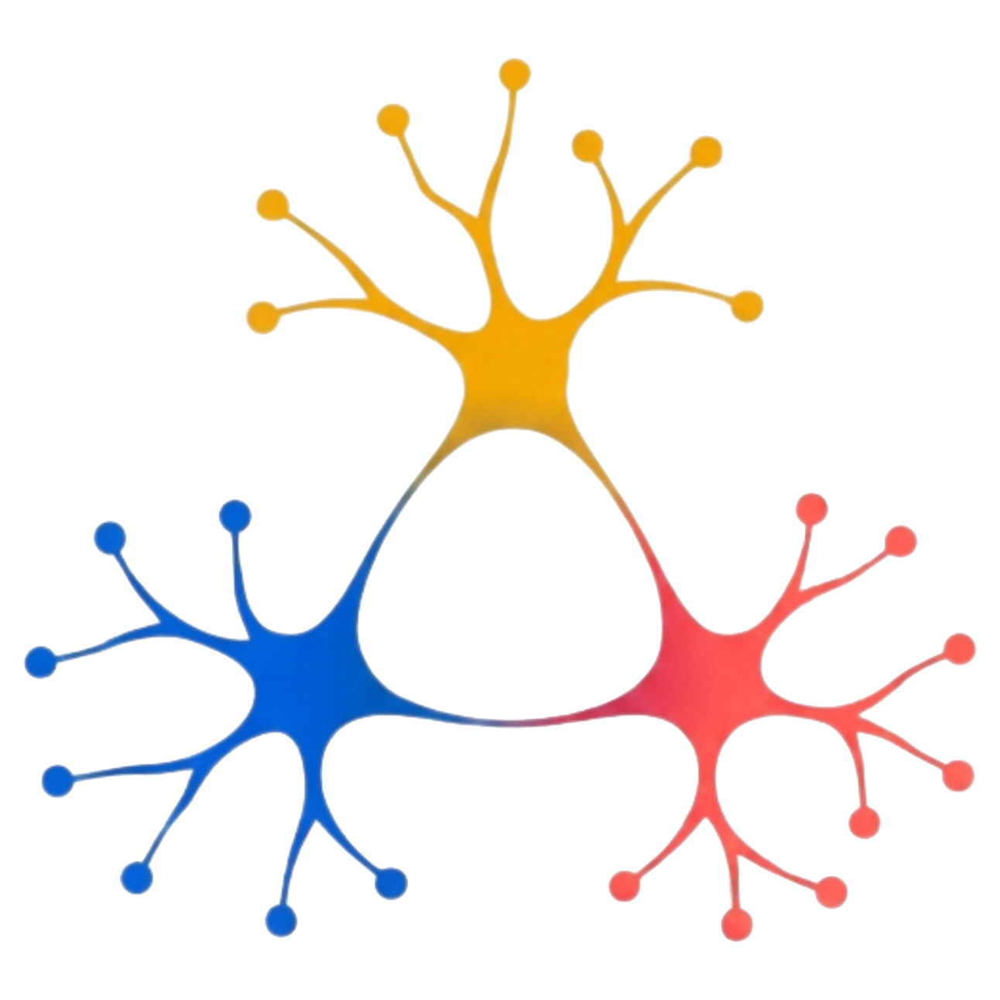
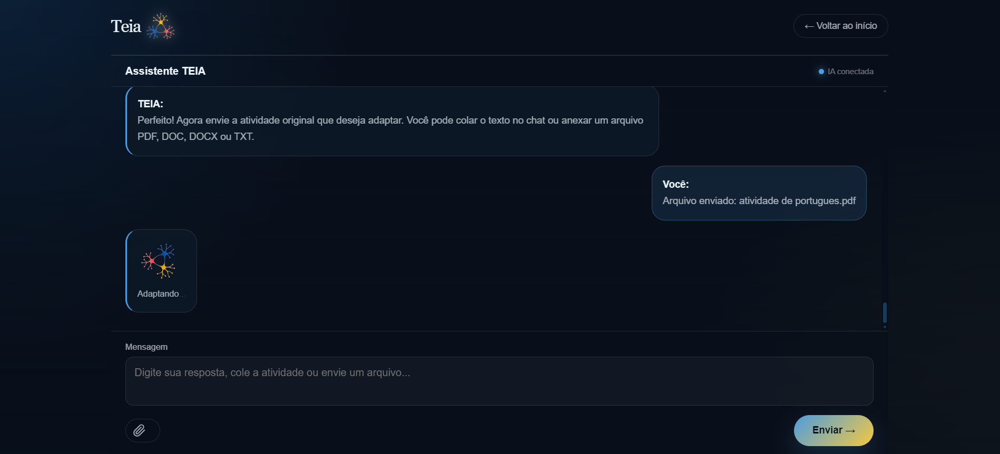
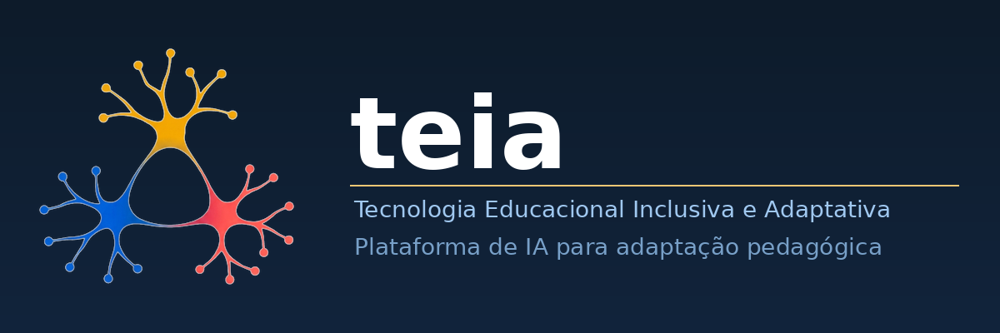

<div align="center">

  <h1> TEIA (MVP) </h1>
  

  <p><strong>Plataforma educacional voltada ao apoio de professores na adaptação de atividades para alunos com Transtorno do Espectro Autista (TEA).</strong></p>

  <br/>

  
  
  
  
  

  <br/>

  
  

</div>

---

## Sobre o Projeto

<div align="center">
  
</div>

<br/>

**TEIA** é uma plataforma educacional desenvolvida com o propósito de facilitar o trabalho dos professores na criação e adaptação de materiais pedagógicos para alunos com Transtorno do Espectro Autista (TEA).

O projeto nasce da necessidade real de tornar a educação mais inclusiva e acessível, oferecendo uma ferramenta prática que permite ao educador personalizar atividades de acordo com o perfil individual de cada aluno. Com uma interface simples e intuitiva, a TEIA conecta o professor às melhores práticas de adaptação curricular, promovendo um ambiente de aprendizagem mais justo e eficaz para todos.

---

## Objetivos

O objetivo principal do projeto é **facilitar o processo de adaptação de atividades escolares**, oferecendo suporte ao professor na criação de materiais mais acessíveis, personalizados e inclusivos para alunos Neurodivergentes.

A plataforma busca:
- Reduzir o tempo gasto pelo professor na adaptação de conteúdos;
- Aumentar a qualidade e consistência dos materiais produzidos;
- Promover a inclusão real dentro do ambiente escolar.

---

## Funcionalidades

- Adaptação de atividades escolares de forma guiada;
- Apoio ao professor com sugestões baseadas no perfil do aluno;
- Interface simples, objetiva e acessível;
- Organização das informações por seções e categorias;
- Personalização conforme as necessidades individuais do aluno;
- Geração de materiais pedagógicos adaptados prontos para uso.

---

## Sobre o Chat

<div align="center">
  
</div>

O Chat TEIA é a funcionalidade principal da plataforma TEIA e o ambiente onde ocorre o processo de adaptação pedagógica das atividades.

Desenvolvido como um assistente conversacional, o sistema auxilia professores na criação de materiais mais acessíveis para estudantes com TEA e outras necessidades educacionais específicas.

---

## Perfil funcional de aprendizagem

Durante a interação, o educador informa características do perfil funcional de aprendizagem do estudante, como:

- nível de suporte;
- faixa etária;
- necessidades sensoriais;
- dificuldades cognitivas;
- características de comunicação;
- perfil pedagógico.

---

## Processo de adaptação

Com base nessas informações e na atividade original enviada pelo professor, o Chat TEIA utiliza Inteligência Artificial para gerar adaptações pedagógicas organizadas, acessíveis e alinhadas ao objetivo educacional da atividade.

---

## Princípios considerados

As adaptações seguem princípios de:

- educação inclusiva;
- acessibilidade cognitiva;
- ABA;
- funções executivas;
- previsibilidade pedagógica;
- suporte visual estruturado;
- metodologias de aprendizagem estruturada.

---

## Objetivo

O sistema busca reduzir a sobrecarga da adaptação manual, oferecer maior apoio pedagógico ao professor e ampliar a participação do estudante no processo de aprendizagem.

## Tecnologias Utilizadas

As seguintes tecnologias foram utilizadas no desenvolvimento da TEIA:

| Tecnologia | Finalidade |
|------------|-----------|
|  **HTML5** | Estruturação das páginas e conteúdo |
|  **CSS3** | Estilização e design responsivo |
|  **JavaScript** | Interatividade e lógica no front-end |
|  **Node.js** | Servidor e lógica de back-end |
|  **API REST** | Integração e comunicação entre serviços |

---

## Dependências

Para executar o projeto localmente, você precisará ter instalado:

- Sistema operacional compatível (Windows, Linux);
- Navegador atualizado (Chrome, Firefox, Edge);
- [Node.js](https://nodejs.org/) (versão 18 ou superior);
- npm (gerenciador de pacotes, incluído com o Node.js);
- O arquivo .env é de extrema importância, pois nele deve está contida a chave da API, que deve ser configurada antes da execução para que seja realizada a conexão com a IA.;
- [Visual Studio Code](https://code.visualstudio.com/) *(recomendado)*.

---

## Instalação

Siga os passos abaixo para rodar o projeto localmente:

**1. Clone o repositório:**

```bash
git clone https://github.com/seu-usuario/teia.git
```

**2. Acesse a pasta do projeto:**

```bash
cd teia
```

**3. Instale as dependências:**

```bash
npm install
```

**4. Inicie o servidor:**

```bash
npm start
```

**5. Acesse no navegador:**

```
http://localhost:3000
```

---

## Nossos Colaboradores

Este projeto foi desenvolvido com dedicação por:

<div align="center">

<table>
  <tr>
    <td align="center">
      <a href="https://github.com/RudysGalaxy">
        
      </a>
    </td>
    <td align="center">
      <a href="https://github.com/joel1fps">
        
      </a>
    </td>
    <td align="center">
      <a href="https://github.com/steffanymachadotk-ai">
        
      </a>
    </td>
    <td align="center">
      <a href="https://github.com/lauangabriell">
        
      </a>
    </td>
  </tr>
</table>

</div>

---

## Agradecimentos

<div align="center">

Agradecemos imensamente ao nosso orientador pelo suporte, direcionamento e dedicação ao longo de todo o desenvolvimento deste projeto.

<br/>

**Orientador:** Prof. João Victor Lopes De Loiola

<br/>

*"A educação é a arma mais poderosa que você pode usar para mudar o mundo."*  
— Nelson Mandela

</div>

---

<div align="center">
  
  <br/><br/>
  <p>Feito pela equipe TEIA</p>
  <p>
    <a href="#teia-mvp">Voltar ao topo </a>
  </p>
</div>
